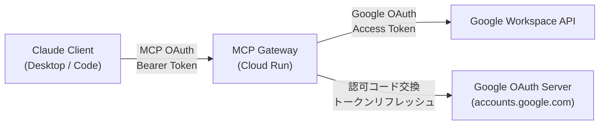
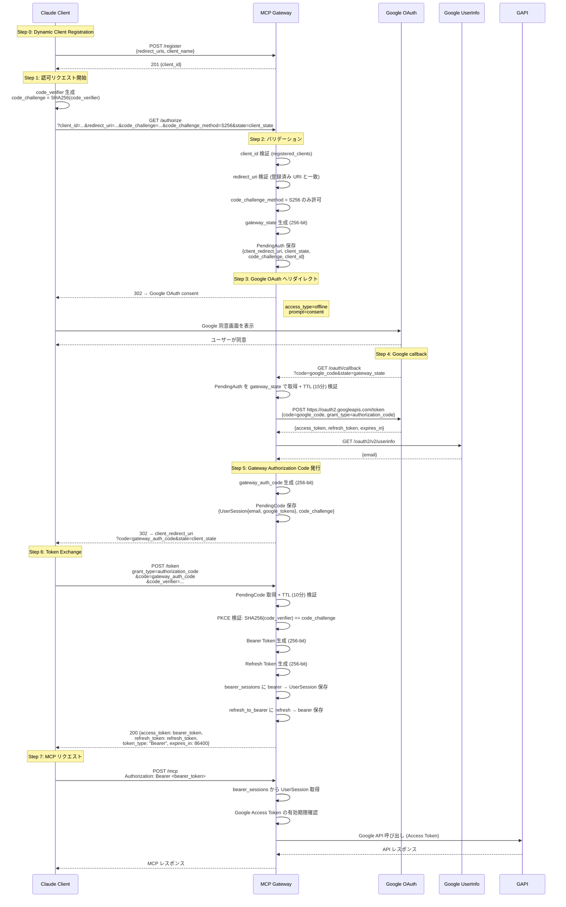
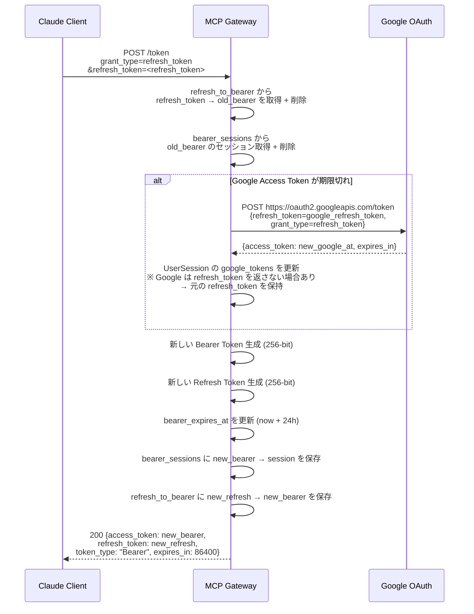
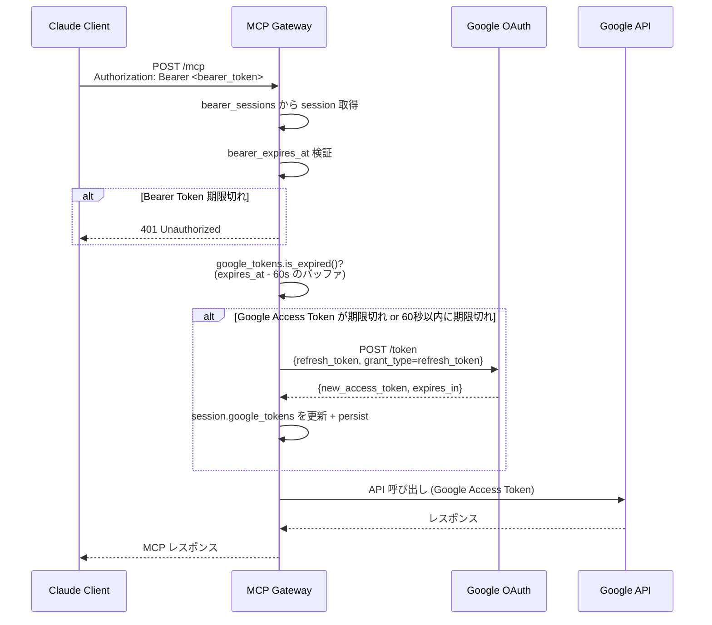
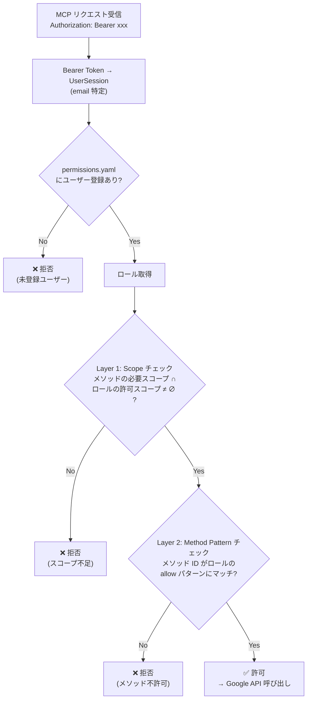
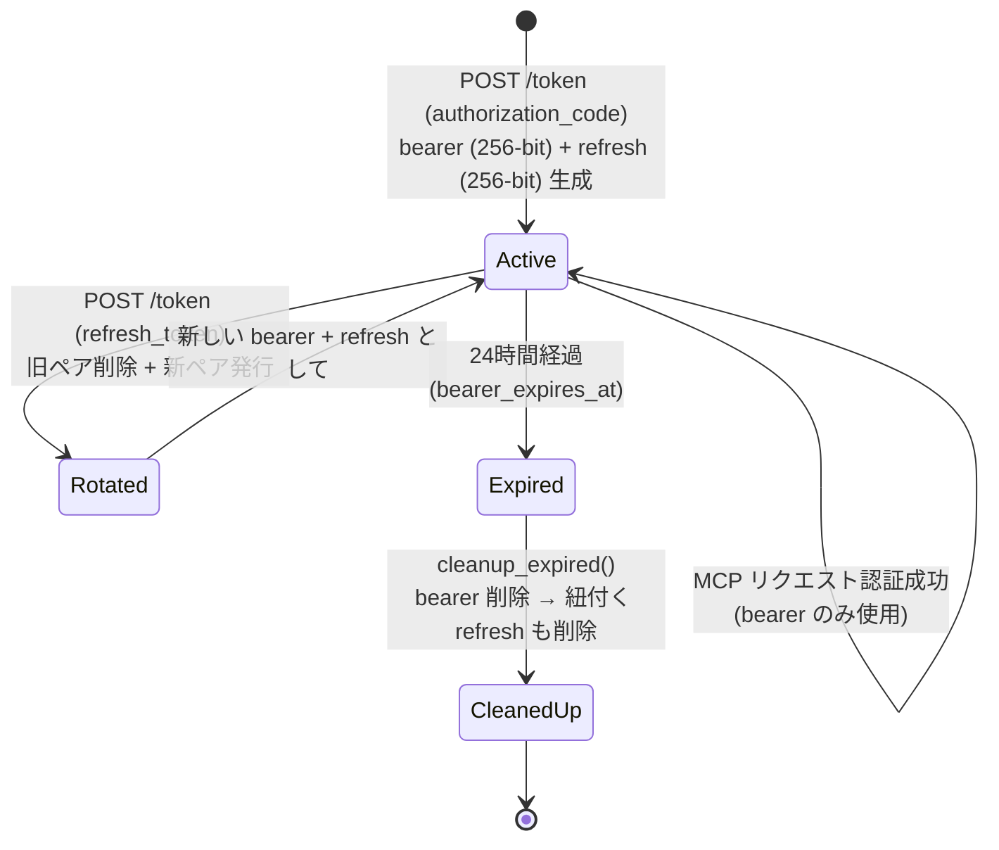
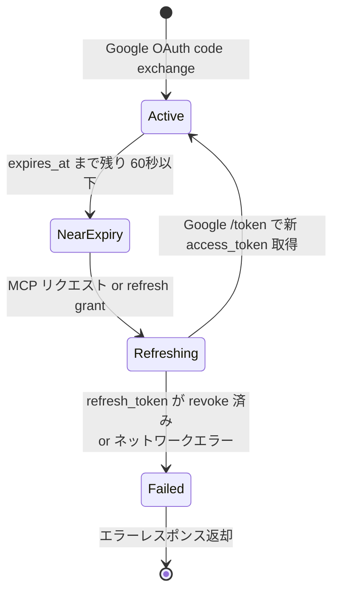
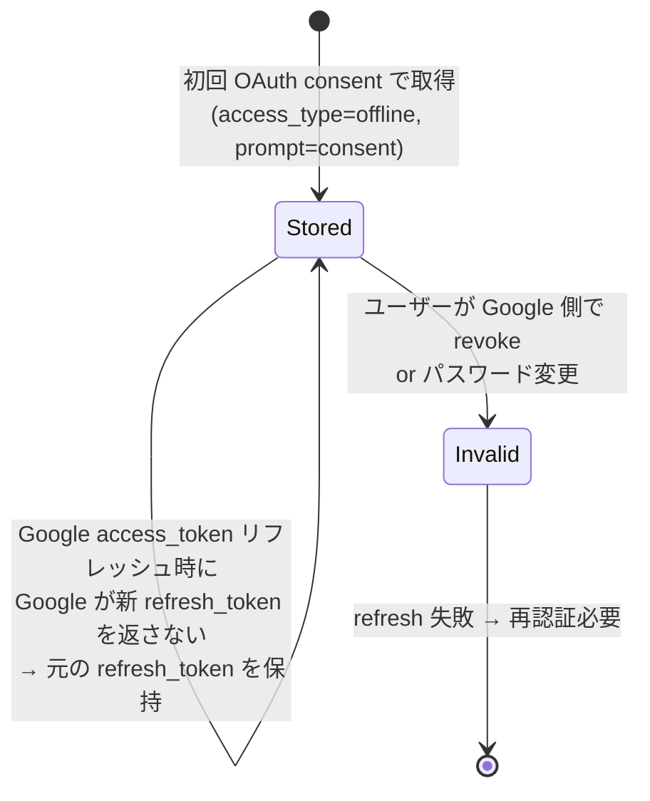
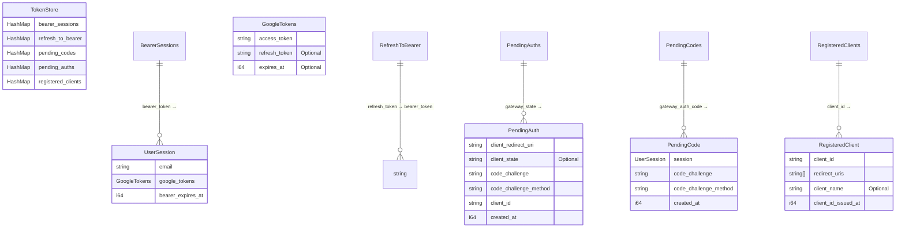

# 認証・認可フロー詳細設計

## 概要

本システムには **2 種類の認証・認可** が存在する。

| # | 認証・認可 | 役割 | プロトコル |
|---|-----------|------|-----------|
| 1 | **MCP OAuth** | Claude Client ↔ Gateway 間の認証 | OAuth 2.1 Authorization Code + PKCE (S256) |
| 2 | **Google OAuth** | Gateway ↔ Google Workspace API 間の認可 | OAuth 2.0 Authorization Code (offline) |

これらは **1 回のログインフローで同時に完了** する設計になっている。

---

## 1. アクター・コンポーネント



---

## 2. トークン一覧

| トークン | 発行者 | 保管場所 | TTL | 用途 |
|---------|--------|---------|-----|------|
| **Gateway Bearer Token** (access_token) | Gateway | クライアント側 + サーバー側 (bearer_sessions) | 24 時間 (86400s) | MCP リクエストの認証 |
| **Gateway Refresh Token** | Gateway | クライアント側 + サーバー側 (refresh_to_bearer) | Bearer Token と同じライフサイクル | Bearer Token のローテーション |
| **Gateway Authorization Code** | Gateway | サーバー側 (pending_codes) | 10 分 (600s) | Bearer Token 取得用の一時コード |
| **Google Access Token** | Google | サーバー側のみ (bearer_sessions) | 約 1 時間 (3600s) | Google API 呼び出し |
| **Google Refresh Token** | Google | サーバー側のみ (bearer_sessions) | 無期限 (revoke まで) | Google Access Token の更新 |
| **PKCE code_verifier / code_challenge** | Client | Client 側 / サーバー側 (pending_auths) | フロー完了まで | 認可コード横取り攻撃の防止 |
| **OAuth state** | Gateway | サーバー側 (pending_auths) | 15 分 (900s) | CSRF 防止 + pending_auth の紐付け |

### Gateway Bearer Token と Refresh Token の関係

- **Bearer Token** (`access_token`): MCP リクエストの `Authorization: Bearer` ヘッダーで使用
- **Refresh Token**: `POST /token` の `grant_type=refresh_token` で使用し、新しい Bearer Token + 新しい Refresh Token を取得
- 両者は **異なる値** (各 256-bit) で、1:1 で紐付く
- Refresh 時は **両方ともローテーション** (旧トークン無効化 + 新トークン発行)

---

## 3. 初回認証フロー (Authorization Code Grant)



---

## 4. Bearer Token リフレッシュフロー

クライアントは token レスポンスで受け取った `refresh_token` を使って新しい Bearer Token + 新しい Refresh Token を取得する。リフレッシュ時に旧トークンペアは無効化される (Token Rotation)。



---

## 5. Google Access Token の透過的リフレッシュ

MCP リクエスト処理中に Google Access Token が期限切れの場合、Gateway が自動でリフレッシュする。クライアントはこの処理を意識しない。



---

## 6. 認可 (Permission Control)

認証後の各 MCP リクエストは **2 層の認可チェック** を通過する必要がある。



### パターンマッチ例

| パターン | マッチするメソッド ID |
|---------|---------------------|
| `*` | すべて |
| `gmail.*` | `gmail.users.messages.list`, `gmail.users.labels.list` など |
| `gmail.users.messages.*` | `gmail.users.messages.list`, `gmail.users.messages.send` など |
| `gmail.users.messages.list` | 完全一致のみ |

### tools/list のフィルタリング

`tools/list` レスポンスはユーザーの権限に基づいてフィルタリングされる。許可されていない tool はリストに含まれないため、Claude のエージェントが不要な試行を行うことを防止する。

---

## 7. トークン状態遷移

### Gateway Bearer Token + Refresh Token ペア



### Google Access Token (サーバー側)



### Google Refresh Token (サーバー側)



---

## 8. サーバー側データストア (TokenStore)



### 容量制限

| Map | 上限 |
|-----|------|
| `bearer_sessions` | 100,000 |
| `refresh_to_bearer` | 100,000 |
| `pending_codes` | 10,000 |
| `pending_auths` | 10,000 |
| `registered_clients` | 10,000 |

### 永続化

- `bearer_sessions` のみ `SessionPersistence` トレイトで永続化 (Secret Manager or Memory)
- `refresh_to_bearer` はインメモリのみ (bearer_sessions から復元不可のため、サーバー再起動時はクライアントの再認証が必要)
- `pending_auths`, `pending_codes` はインメモリのみ (短命のため)
- `registered_clients` はインメモリのみ (サーバー再起動で再登録が必要)

### クリーンアップ

`cleanup_expired()` で以下を削除:
- `pending_auths`: `created_at` から 15 分経過
- `pending_codes`: `created_at` から 10 分経過
- `bearer_sessions`: `bearer_expires_at` を超過
- `refresh_to_bearer`: 紐付く bearer が `bearer_sessions` に存在しないもの

---

## 9. エンドポイント一覧

| メソッド | パス | 説明 | 認証 |
|---------|------|------|------|
| GET | `/.well-known/oauth-authorization-server` | OAuth メタデータ (RFC 8414) | 不要 |
| POST | `/register` | Dynamic Client Registration (RFC 7591) | 不要 |
| GET | `/authorize` | 認可フロー開始 → Google OAuth へリダイレクト | 不要 |
| GET | `/oauth/callback` | Google OAuth コールバック → クライアントへリダイレクト | 不要 (Google からの redirect) |
| POST | `/token` | Bearer Token + Refresh Token 発行 / リフレッシュ | 不要 (code or refresh_token で検証) |
| POST | `/mcp` | MCP JSON-RPC リクエスト | Bearer Token 必須 |
| GET | `/mcp` | SSE ストリーム開始 | Bearer Token 必須 |
| DELETE | `/mcp` | セッション終了 | Bearer Token 必須 |

### POST /token レスポンス形式

```json
{
  "access_token": "<bearer_token (256-bit)>",
  "token_type": "Bearer",
  "expires_in": 86400,
  "refresh_token": "<refresh_token (256-bit, bearer とは別の値)>"
}
```

---

## 10. セキュリティ設計方針

| 方針 | 実装 |
|------|------|
| Google トークンはクライアントに露出しない | サーバー側保持、レスポンスに含めない |
| PKCE 必須 (S256 のみ) | plain は明示的に拒否 |
| Bearer Token / Refresh Token は暗号学的に安全 | 各 256-bit OsRng エントロピー |
| Refresh Token Rotation | refresh 時に旧ペアを無効化し新ペアを発行 |
| redirect_uri はスキーム検証 | https:// or http://localhost のみ |
| クライアント登録制 | /authorize 時に registered_clients を検証 |
| 期限切れの自動クリーンアップ | リクエスト時に cleanup_expired() を実行 |
| Token レスポンスはキャッシュ禁止 | Cache-Control: no-store |
| Google token refresh に 60 秒バッファ | リクエスト途中の期限切れを防止 |
