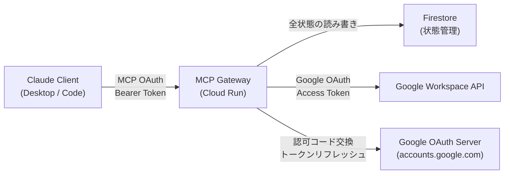
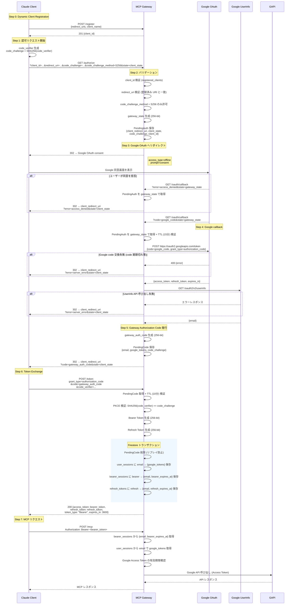
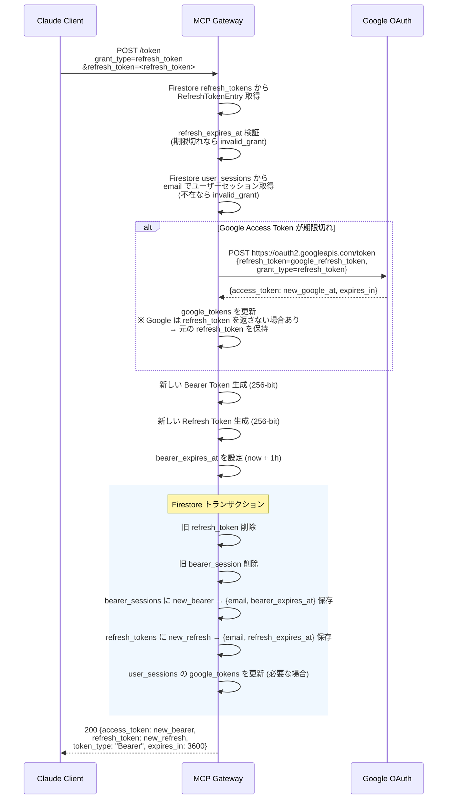
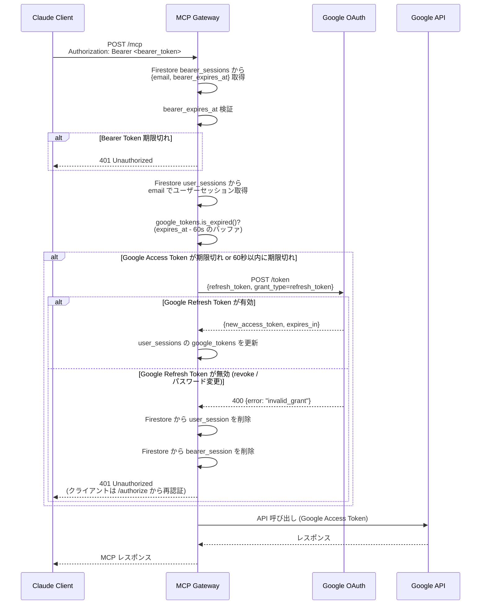
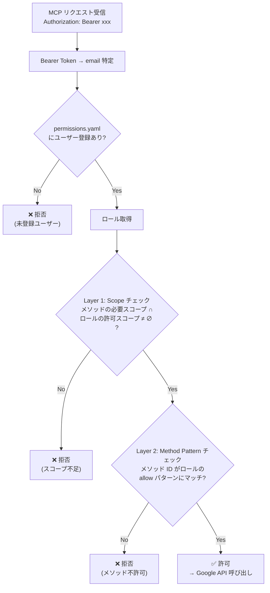
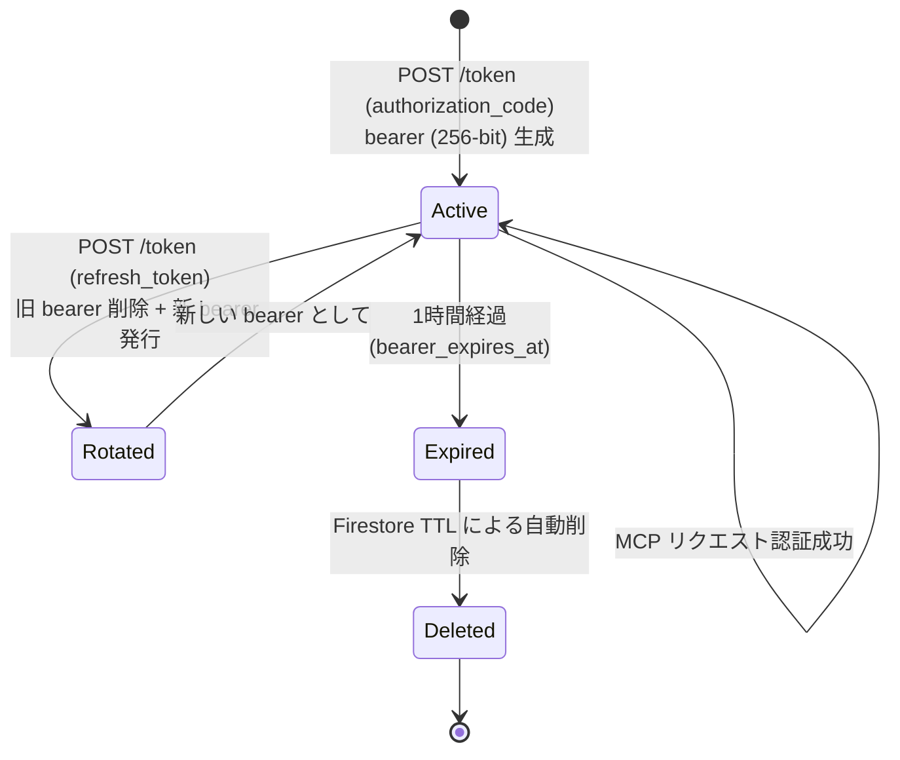
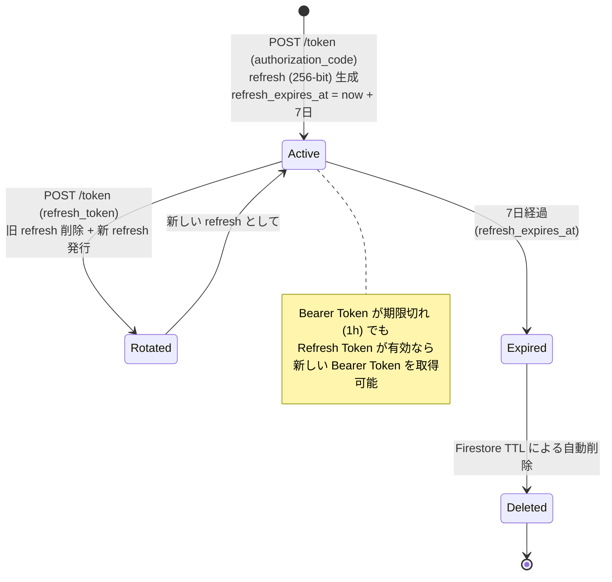
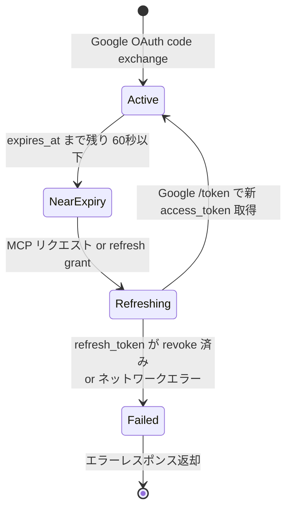
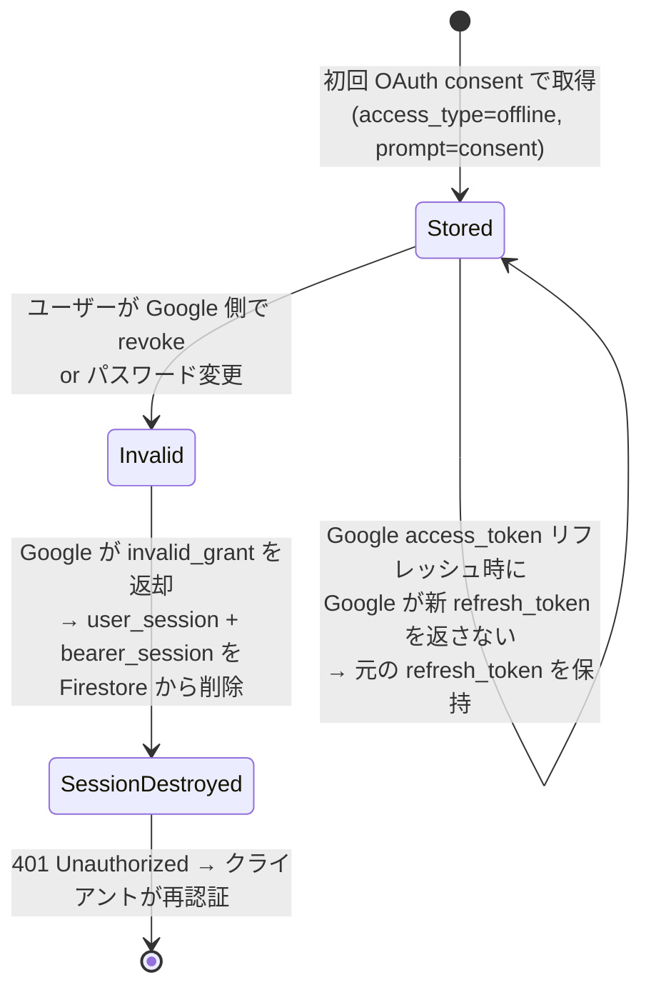
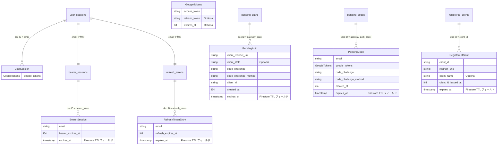

# 認証・認可フロー詳細設計

## 概要

本システムには **2 種類の認証・認可** が存在する。

| # | 認証・認可 | 役割 | プロトコル |
|---|-----------|------|-----------|
| 1 | **MCP OAuth** | Claude Client ↔ Gateway 間の認証 | OAuth 2.1 Authorization Code + PKCE (S256) |
| 2 | **Google OAuth** | Gateway ↔ Google Workspace API 間の認可 | OAuth 2.0 Authorization Code (offline) |

これらは **1 回のログインフローで同時に完了** する設計になっている。

---

## 1. アクター・コンポーネント



---

## 2. トークン一覧

| トークン | 発行者 | 保管場所 | TTL | 用途 |
|---------|--------|---------|-----|------|
| **Gateway Bearer Token** (access_token) | Gateway | クライアント側 + Firestore (`bearer_sessions`) | 1 時間 (3600s) | MCP リクエストの認証 |
| **Gateway Refresh Token** | Gateway | クライアント側 + Firestore (`refresh_tokens`) | 7 日 (604800s) — Bearer Token とは独立 | Bearer Token のローテーション |
| **Gateway Authorization Code** | Gateway | Firestore (`pending_codes`) | 10 分 (600s) | Bearer Token 取得用の一時コード |
| **Google Access Token** | Google | Firestore のみ (`user_sessions` 内) | 約 1 時間 (3600s) | Google API 呼び出し |
| **Google Refresh Token** | Google | Firestore のみ (`user_sessions` 内) | 無期限 (revoke まで) | Google Access Token の更新 |
| **PKCE code_verifier / code_challenge** | Client | Client 側 / Firestore (`pending_auths`) | フロー完了まで | 認可コード横取り攻撃の防止 |
| **OAuth state** | Gateway | Firestore (`pending_auths`) | 15 分 (900s) | CSRF 防止 + pending_auth の紐付け |

### Gateway Bearer Token と Refresh Token の関係

- **Bearer Token** (`access_token`): MCP リクエストの `Authorization: Bearer` ヘッダーで使用。短命 (1 時間)
- **Refresh Token**: `POST /token` の `grant_type=refresh_token` で使用し、新しい Bearer Token + 新しい Refresh Token を取得。長命 (7 日)
- 両者は **異なる値** (各 256-bit) で、**独立した TTL** を持つ
- Refresh 時は **両方ともローテーション** (旧トークン無効化 + 新トークン発行)
- Bearer Token が期限切れでも、Refresh Token が有効であれば新しい Bearer Token を取得可能

---

## 3. 初回認証フロー (Authorization Code Grant)



---

## 4. Bearer Token リフレッシュフロー

クライアントは token レスポンスで受け取った `refresh_token` を使って新しい Bearer Token + 新しい Refresh Token を取得する。リフレッシュ時に旧トークンペアは無効化される (Token Rotation)。

**トークンローテーションは Firestore トランザクションで実行する。** 旧トークン削除と新トークン書き込みをアトミックに行うことで、以下を保証する:

- 部分的な書き込み失敗によるセッション喪失を防止
- 同一 Refresh Token の同時使用 (race condition) で一方のみが成功し、他方はトランザクション競合でエラー
- 常に「1 セッション = 1 Bearer Token + 1 Refresh Token」の不変条件を維持



---

## 5. Google Access Token の透過的リフレッシュ

MCP リクエスト処理中に Google Access Token が期限切れの場合、Gateway が自動でリフレッシュする。クライアントはこの処理を意識しない。



---

## 6. 認可 (Permission Control)

認証後の各 MCP リクエストは **2 層の認可チェック** を通過する必要がある。



### パターンマッチ例

| パターン | マッチするメソッド ID |
|---------|---------------------|
| `*` | すべて |
| `gmail.*` | `gmail.users.messages.list`, `gmail.users.labels.list` など |
| `gmail.users.messages.*` | `gmail.users.messages.list`, `gmail.users.messages.send` など |
| `gmail.users.messages.list` | 完全一致のみ |

### tools/list のフィルタリング

`tools/list` レスポンスはユーザーの権限に基づいてフィルタリングされる。許可されていない tool はリストに含まれないため、Claude のエージェントが不要な試行を行うことを防止する。

---

## 7. トークン状態遷移

### Gateway Bearer Token



### Gateway Refresh Token



### Google Access Token (サーバー側)



### Google Refresh Token (サーバー側)



---

## 8. サーバー側データストア (StateStore)

サーバーは **完全ステートレス** で動作する。全状態は外部ストア (Firestore) に保存され、サーバー再起動やスケールアウトの影響を受けない。

### ストアバックエンド

| バックエンド | 用途 | 特徴 |
|-------------|------|------|
| **Firestore** | 本番 (Cloud Run) | 全状態を永続化。TTL ポリシーで自動削除。マルチインスタンス対応 |
| **InMemory** | ローカル開発・テスト | HashMap ベース。プロセス終了で消失。容量制限あり |

### Firestore コレクション構造



### データモデル設計方針

Google tokens (ユーザーと Google 間の関係) は、Bearer Token / Refresh Token (クライアントと Gateway 間の関係) から分離し、**`user_sessions` コレクション**で独立管理する。

| コレクション | 関心事 | ライフサイクル |
|-------------|--------|-------------|
| `user_sessions` | ユーザーと Google API の連携 | Google Refresh Token が有効な間 (明示的削除まで) |
| `bearer_sessions` | クライアントの MCP リクエスト認証 | 1 時間 (短命) |
| `refresh_tokens` | Bearer Token の更新権 | 7 日 (長命) |

この分離により:
- 各エンティティの TTL がドメイン上の意味と一致する
- Bearer Token 期限切れ (1h) 後も Refresh Token (7d) で復元可能 (Google tokens は `user_sessions` に独立して存在)
- 同一ユーザーの複数セッション (Claude Desktop + Claude Code) を自然にサポート — 複数の bearer/refresh が同一 email の `user_sessions` を共有

### Firestore ドキュメント形式

各ドキュメントは以下の 2 フィールドで構成:

| フィールド | 型 | 用途 |
|-----------|-----|------|
| `data` | `stringValue` | 構造体を JSON シリアライズ → **AES-256-GCM で暗号化** → Base64 エンコードした文字列 |
| `expires_at` | `timestampValue` | Firestore TTL ポリシーによる自動削除用 (`user_sessions` は TTL なし) |

### アプリケーション層暗号化 (Encryption at Rest)

Firestore には Google OAuth トークン (access_token, refresh_token) を含む機密データが保存される。Firestore のデフォルト暗号化 (Google-managed key) に加え、**アプリケーション層で AES-256-GCM 暗号化** を適用する。

#### 暗号化アーキテクチャ

```
書き込み: struct → JSON serialize → AES-256-GCM encrypt → Base64 encode → Firestore `data` field
読み取り: Firestore `data` field → Base64 decode → AES-256-GCM decrypt → JSON deserialize → struct
```

#### 暗号化仕様

| 項目 | 値 |
|------|-----|
| アルゴリズム | AES-256-GCM (AEAD) |
| 鍵長 | 256 bit |
| Nonce | 96 bit (各暗号化操作で一意に生成) |
| 鍵の保管場所 | **Secret Manager** (`projects/{project}/secrets/firestore-encryption-key`) |
| 鍵のロード | サーバー起動時に Secret Manager から取得し、メモリ上に保持 |
| Base64 エンコード | `nonce (12 bytes) || ciphertext || tag (16 bytes)` を結合して Base64 |

#### 鍵管理

- 暗号化鍵は **Secret Manager** に保存し、Cloud Run サービスアカウントのみアクセス可能にする
- 鍵のローテーション時は新しいバージョンを追加し、古いバージョンで暗号化されたデータは TTL で自然消滅する (Bearer: 1h, Refresh: 7d, UserSession: invalid_grant 時に削除)
- 鍵ローテーション中の復号失敗時は、セッションを無効として扱い再認証を促す (データロスなし)

#### 追加のセキュリティ対策

| 対策 | 説明 |
|------|------|
| 専用 Firestore データベース | デフォルト DB ではなく、MCP Gateway 専用の名前付き DB を使用。他サービスとの分離 |
| Data Access 監査ログ | Firestore の Data Access 監査ログを有効化。不正アクセスの検知・追跡 |
| 最小権限 IAM | Cloud Run サービスアカウントに `datastore.user` ロールのみ付与 |

### TTL 設定

| コレクション | ドキュメント ID | expires_at | 用途 |
|-------------|---------------|------------|------|
| `user_sessions` | email | なし (明示的削除) | Google 連携セッション |
| `bearer_sessions` | bearer_token | now + 1h | Bearer Token セッション |
| `refresh_tokens` | refresh_token | now + 7d | Refresh Token エントリ |
| `pending_auths` | gateway_state | now + 15m | OAuth 認可フロー中間状態 |
| `pending_codes` | auth_code | now + 10m | 認可コード交換待ち |
| `registered_clients` | client_id | now + 7d | 動的クライアント登録 |

`user_sessions` は Firestore TTL を設定しない。Google Refresh Token が `invalid_grant` を返した時点で明示的に削除する。20 名規模で最大 20 ドキュメントのため、TTL なしでも問題ない。

Firestore TTL ポリシーは各コレクションの `expires_at` フィールドに対して有効化する:

```bash
gcloud firestore fields ttls update expires_at \
  --collection-group=bearer_sessions --enable-ttl
# refresh_tokens, pending_auths, pending_codes, registered_clients も同様
# user_sessions は TTL 不要
```

> **注意**: Firestore TTL による削除は結果整合性 (数分〜最大 24 時間の遅延)。アプリケーションコードでも TTL を検証し、期限切れドキュメントは無効として扱う。

### 容量制限 (InMemory バックエンドのみ)

| Map | 上限 |
|-----|------|
| `user_sessions` | 10,000 |
| `bearer_sessions` | 100,000 |
| `refresh_tokens` | 100,000 |
| `pending_codes` | 10,000 |
| `pending_auths` | 10,000 |
| `registered_clients` | 10,000 |

InMemory バックエンドでは `set_*()` メソッド内で `cleanup_expired()` を実行し、上限を超える場合はエラーを返す。
`bearer_sessions` と `refresh_tokens` の **両方** で容量チェックを行う。

Firestore バックエンドでは容量制限は不要 (TTL で自動削除、Firestore 自体が大規模データに対応)。

### クリーンアップ

| バックエンド | 方式 |
|-------------|------|
| **Firestore** | `expires_at` フィールドに基づく TTL ポリシーで自動削除。`user_sessions` は `invalid_grant` 時に明示的に削除。アプリケーション側の定期クリーンアップは不要 |
| **InMemory** | `set_*()` 呼び出し時に `cleanup_expired()` を内部実行し、期限切れエントリを除去 |

InMemory の `cleanup_expired()` で削除される条件:
- `pending_auths`: `created_at` から 15 分経過
- `pending_codes`: `created_at` から 10 分経過
- `bearer_sessions`: `bearer_expires_at` を超過
- `refresh_tokens`: `refresh_expires_at` を超過
- `registered_clients`: `client_id_issued_at` から 7 日経過
- `user_sessions`: InMemory では明示的削除のみ (TTL なし)

---

## 9. エンドポイント一覧

| メソッド | パス | 説明 | 認証 |
|---------|------|------|------|
| GET | `/.well-known/oauth-authorization-server` | OAuth メタデータ (RFC 8414) | 不要 |
| POST | `/register` | Dynamic Client Registration (RFC 7591) | 不要 |
| GET | `/authorize` | 認可フロー開始 → Google OAuth へリダイレクト | 不要 |
| GET | `/oauth/callback` | Google OAuth コールバック → クライアントへリダイレクト | 不要 (Google からの redirect) |
| POST | `/token` | Bearer Token + Refresh Token 発行 / リフレッシュ | 不要 (code or refresh_token で検証) |
| POST | `/mcp` | MCP JSON-RPC リクエスト | Bearer Token 必須 |
| GET | `/mcp` | SSE ストリーム開始 | Bearer Token 必須 |
| DELETE | `/mcp` | セッション終了 | Bearer Token 必須 |

### POST /token レスポンス形式

```json
{
  "access_token": "<bearer_token (256-bit)>",
  "token_type": "Bearer",
  "expires_in": 3600,
  "refresh_token": "<refresh_token (256-bit, bearer とは独立した TTL)>"
}
```

---

## 10. セキュリティ設計方針

| 方針 | 実装 |
|------|------|
| 全状態の外部ストア化 | Firestore に全状態を保存。サーバーは完全ステートレスで、再起動・スケールアウトに耐える |
| Bearer Token 短命 / Refresh Token 長命 | Bearer Token: 1 時間、Refresh Token: 7 日 (独立 TTL)。漏洩時の影響を最小化 |
| Google トークンはクライアントに露出しない | サーバー側 (Firestore `user_sessions`) 保持、レスポンスに含めない |
| ドメインモデルに基づくデータ分離 | Google 連携 (`user_sessions`)、クライアント認証 (`bearer_sessions`)、更新権 (`refresh_tokens`) を独立コレクションで管理。TTL が各エンティティの意味と一致 |
| PKCE 必須 (S256 のみ) | plain は明示的に拒否 |
| Bearer Token / Refresh Token は暗号学的に安全 | 各 256-bit OsRng エントロピー |
| Refresh Token Rotation | refresh 時に旧ペアを無効化し新ペアを発行。Firestore トランザクションでアトミック実行 |
| 認証フローのエラー伝播 | Google 同意拒否・code 交換失敗・UserInfo 取得失敗時は `client_redirect_uri` に OAuth 2.1 標準のエラーパラメータ (`?error=...&state=...`) でリダイレクト |
| redirect_uri はスキーム検証 | https:// or http://localhost のみ |
| クライアント登録制 | /authorize 時に registered_clients を検証 |
| 期限切れの自動クリーンアップ | Firestore: TTL ポリシーで自動削除。InMemory: set_*() 時に cleanup_expired() を実行 |
| Token レスポンスはキャッシュ禁止 | Cache-Control: no-store |
| Google token refresh に 60 秒バッファ | リクエスト途中の期限切れを防止 |
| Google Refresh Token 失効時のセッション無効化 | Google が `invalid_grant` を返した場合、`user_session` と `bearer_session` を Firestore から削除し 401 を返却。関連する `refresh_token` は次回使用時に `user_session` 不在で失敗し、再認証を促す |
| Firestore データのアプリケーション層暗号化 | AES-256-GCM で `data` フィールドを暗号化。暗号化鍵は Secret Manager に保管。Firestore のデフォルト暗号化との二重防御 |
| 専用 Firestore データベース | MCP Gateway 専用の名前付き DB を使用し、他サービスと分離 |
| Data Access 監査ログ | Firestore の Data Access 監査ログを有効化し、不正アクセスを検知・追跡可能にする |
| トークン値のログ記録禁止 | 構造化ログにトークン値 (Bearer Token, Refresh Token, Google tokens) を含めない。ログにはトークンのプレフィックスまたはハッシュのみ記録し、デバッグ時の追跡性を確保 |
| Firestore 障害時のエラーハンドリング | Firestore が利用不可の場合は 503 Service Unavailable を返却。部分的な障害 (読み取り可・書き込み不可) では既存セッションの MCP リクエストは処理可能 |
